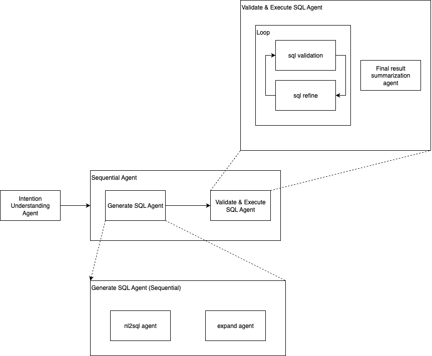

# BigQuery Billing Agent

A natural language interface for querying Google Cloud Platform billing data using BigQuery. This agent allows users to ask questions about their GCP billing in plain English and get accurate SQL-powered responses.

## Overview

The BigQuery Billing Agent is built on Google's Agent Development Kit (ADK) and uses Gemini LLM models to:

1. Understand natural language questions about GCP billing
2. Convert these questions to optimized BigQuery SQL queries
3. Validate and refine the SQL for correctness
4. Execute the queries against BigQuery billing export tables
5. Return formatted results to the user

## Architecture



The agent consists of several specialized components:


### Root Agent (`intend_agent`)
- Analyzes user questions to understand intent
- Identifies required timeframes and other parameters
- Asks clarifying questions when needed
- Routes requests to specialized sub-agents

### NL2SQL Pipeline
- **NL2SQL Agent**: Converts natural language to initial SQL query
- **Expand Agent**: Adapts SQL to work with multiple billing tables using UNION ALL

### Validation & Execution Pipeline
- **SQL Validator**: Checks SQL syntax and semantics
- **SQL Refiner**: Corrects errors in SQL statements
- **Execution Engine**: Runs validated SQL against BigQuery
- **Report Composer**: Formats results for presentation

## Prerequisites

- Python 3.11+
- Google Cloud Platform account with:
  - BigQuery API enabled
  - Billing export to BigQuery configured
  - Appropriate permissions to access billing data

## Setup

1. Clone the repository:
   ```bash
   git clone https://github.com/sunchengxuanivy/bq-billing-agent.git
   cd bq-billing-agent
   ```

2. Create and activate a Python virtual environment:
   ```bash
   # Create virtual environment
   python -m venv venv
   
   # Activate on Windows
   venv\Scripts\activate
   
   # Activate on macOS/Linux
   source venv/bin/activate
   ```

3. Install dependencies:
   ```bash
   pip install -r requirements.txt
   ```

4. Configure environment variables:
   ```bash
   # Copy the template file to create your .env file
   cp billing_agent/.env.template billing_agent/.env
   
   # Edit the .env file with your specific configuration
   ```

5. Edit the `.env` file with your specific configuration:
   - `AGENT_MODEL`: Gemini model to use (default: gemini-2.5-flash)
   - `BQ_PROJECT_ID`: Your Google Cloud project ID
   - `PROTOTYPE_DETAILED_BILLING_TABLE_ID`: Your primary billing export table
   - `TARGET_BILLING_TABLES`: Comma-separated list of additional billing tables
   - `GOOGLE_CLOUD_PROJECT`: Your Google Cloud project for Vertex AI
   - `GOOGLE_CLOUD_LOCATION`: Vertex AI location (e.g., us-central1)

6. Authenticate with Google Cloud:
   ```bash
   gcloud auth application-default login
   ```

## Running the Agent

Start the FastAPI server:

```bash
adk web
```

The server will be available at http://localhost:8080 by default.

## Usage Examples

Here are some example questions you can ask the agent:

- "What was my total GCP spend 202506?"
- "Show me the top 5 services by cost in Q1 2024"
- "Which projects had the highest Cloud Storage costs last quarter?"

## Environment Variables

| Variable | Description | Example |
|----------|-------------|---------|
| AGENT_MODEL | Gemini model to use | gemini-2.5-flash |
| BQ_PROJECT_ID | Google Cloud project ID | my-gcp-project |
| PROTOTYPE_DETAILED_BILLING_TABLE_ID | Primary billing export table | project.dataset.billing_export_table |
| TARGET_BILLING_TABLES | Additional billing tables (comma-separated) | project1.dataset.table1,project2.dataset.table2 |
| GOOGLE_GENAI_USE_VERTEXAI | Use Vertex AI for Gemini | 1 |
| GOOGLE_CLOUD_PROJECT | GCP project for Vertex AI | my-gcp-project |
| GOOGLE_CLOUD_LOCATION | Vertex AI location | us-central1 |
